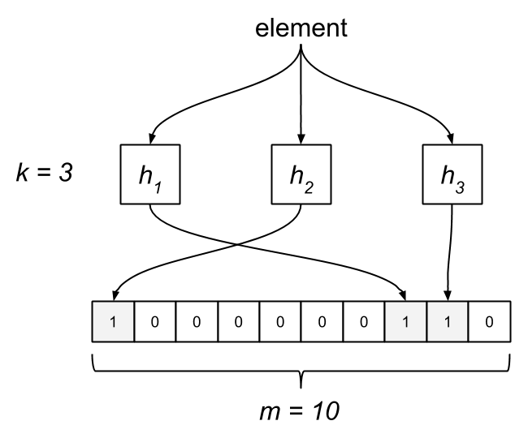

A Bloom filter is a space-efficient probabilistic data structure that is used to test whether an element is a member of a set.

# 👷🏻 Working

A empty bloom filter is a bit array of m bits, all set to zero, like this –



We need k number of hash functions to calculate the hashes for a given input. When we want to add an item in the filter, the bits at k indices h1(x), h2(x), … hk(x) are set, where indices are calculated using hash functions.

**Example – Suppose we want to enter “blumea” in the filter, we are using 3 hash functions and a bit array of length 10, all set to 0 initially. First we’ll calculate the hashes as follows:**

```bash
h1(“blumea”) % 10 = 1
h2(“blumea”) % 10 = 8
h3(“blumea”) % 10 = 9
```

Note: These outputs are random for explanation only.
Now we will set the bits at indices 1, 8 and 9 to 1
